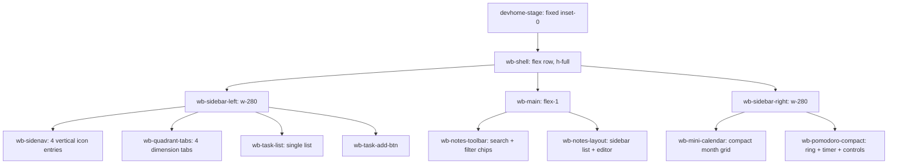

## 产品概述

将 DevHome Workbench 从单列居中 Tab 切换布局，重构为**三栏常驻非对称布局**。左栏承载导航与四象限分类视图，中栏为核心笔记创作区（最大视觉空间），右栏为时间管理中枢（日历+番茄钟）。三栏同时可见，无需切换面板。

## 核心功能

- **三栏布局**：左栏(280px) | 中栏(flex:1) | 右栏(280px)，全屏固定，overflow: hidden
- **左栏侧边导航**：4 个纵向图标入口（任务/记录/日历/番茄钟），点击展开左侧对应面板
- **四象限分类视图**：横向标签切换四个维度 + 单一任务列表 + 维度下拉选择器 + 底部"+ 添加任务"
- **中栏笔记工作区**：顶部搜索+分类标签工具栏 + 双窗格（笔记列表 + 富文本编辑器）
- **右栏时间中枢**：上部迷你日历看板（7列月视图，今天高亮） + 下部番茄钟（进度圆环+控件）
- **版本升级**：2.3.1 → 2.4.0

## 技术栈

- HTML5 + CSS3（复用 Semantic Design Token 体系）+ Vanilla JS（IIFE 模块模式）
- 无外部框架或依赖

## 实现策略

**"HTML 全量重写 + CSS 从零重设计 + JS 适配层最小化"**

- HTML：`devhome-stage` 内部结构全量替换为三栏式
- CSS：`css/workbench.css` 全量重写，保留现有弹窗/预览样式
- JS：核心逻辑（任务CRUD/番茄钟/日历导航/存储）零改动，仅调整 DOM 引用和事件路由

## 架构设计



## 目录结构

```
d:\gitHub\DevHome Workbench\
├── index.html                 # [MODIFY] devhome-stage 全量重写为三栏式
├── css/
│   ├── workbench.css          # [MODIFY] 全量重写，保留 popup 预览 + 响应式 + reduced-motion
│   └── tokens.css             # [MODIFY] 新增 --color-sidebar-bg 令牌
├── css/themes/
│   └── default.css            # [MODIFY] 新增 --_deep-sidebar-bg / --_light-sidebar-bg
├── js/
│   ├── workbench.js           # [MODIFY] 新增 switchSidebar，改造 renderQuadrantBoard，新增 renderMiniCalendar
│   └── events.js              # [MODIFY] 侧边导航事件、象限标签事件、维度下拉事件
└── manifest.json              # [MODIFY] 2.3.1 → 2.4.0
```

## 关键代码结构

**新增 JS 函数签名**：

```
ns.switchSidebar(panelName)      // 在左栏展开对应面板（tasks/notes/calendar/pomodoro）
ns.renderQuadrantBoard()         // 改造：按 _activeQuadrant 渲染单一 taskList
ns.changeTaskQuadrant(taskId, fromQ, toQ)  // 维度下拉切换
ns.renderMiniCalendar(date)      // 右栏迷你日历渲染
ns.navigateMiniCalendar(delta)   // 右栏日历月导航
```

**新增 CSS 类**：

```
.wb-shell           // 三栏 flex 容器
.wb-sidebar-left   // 左栏 280px
.wb-sidebar-right  // 右栏 280px
.wb-main            // 中栏 flex:1
.wb-sidenav         // 纵向导航入口
.wb-sidenav-item    // 单个导航项
.wb-quadrant-tabs   // 四象限横向标签
.wb-quadrant-tab    // 单个标签
.wb-task-selector   // 维度下拉选择器
.wb-mini-calendar   // 迷你日历容器
.wb-mini-calendar-grid // 7列日期网格
```

## 设计风格

采用 **Glassmorphism 深海科技三栏布局**，深蓝色系为主、薄荷绿为强调色。左栏和右栏为半透明毛玻璃侧边栏，中栏为宽幅沉浸式工作区。

## 左栏（侧边导航与任务区）

- 宽 280px，右边界 1px 毛玻璃边框分隔
- 顶部：4 个纵向排列的导航图标项（任务/记录/日历/番茄钟），每项含 20px SVG 图标 + 12px 文字，hover 时薄荷绿高亮
- 四象限区：横向 4 个胶囊标签，active 薄荷绿填充 + 发光边框，下方单一任务列表（最大高度填充剩余空间）
- 任务项：左侧复选框 + 标题 + 右侧维度下拉 select，紧凑间距
- 底部 "+ 添加任务" 虚线按钮

## 中栏（笔记工作区）

- flex:1 宽幅，padding 24px 28px
- 顶部工具栏：左侧搜索输入框(圆角12px) + 漏斗按钮，右侧横向胶囊分类标签
- 双窗格：左窗格 280px 笔记列表（每条标题+时间+类型徽章），右窗格 flex:1 编辑器

## 右栏（时间管理中枢）

- 宽 280px，左边界 1px 毛玻璃边框分隔
- 上部迷你日历：紧凑月视图，7 列网格，月份导航箭头 + 标题，今天高亮薄荷绿圆角背景
- 下部番茄钟：160px 进度圆环 + 32px 数字计时器 + 开始/重置按钮 + 时长药丸按钮

## 全局

- 字体：Inter 无衬线字体系统
- 动画：微过渡 0.2s ease，面板入场淡入
- 滚动：左栏和右栏独立 overflow-y: auto